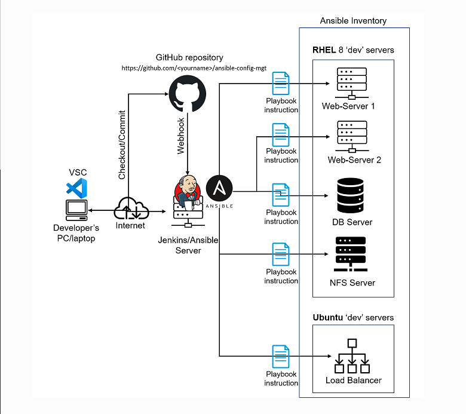
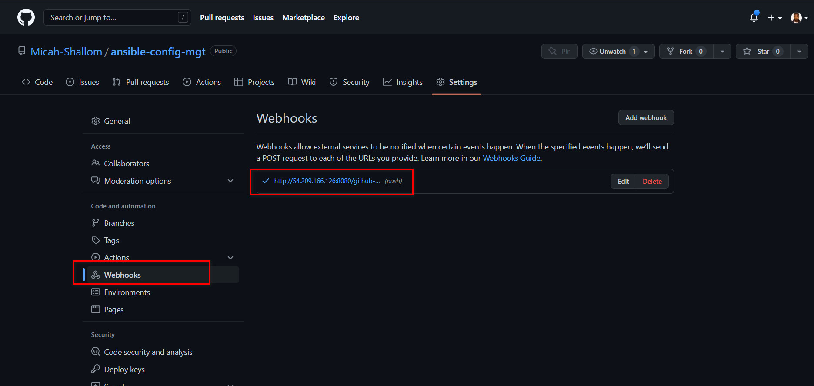
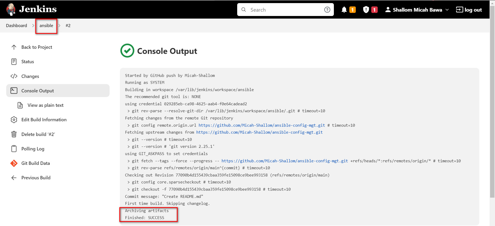
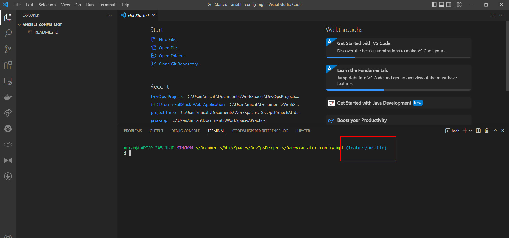
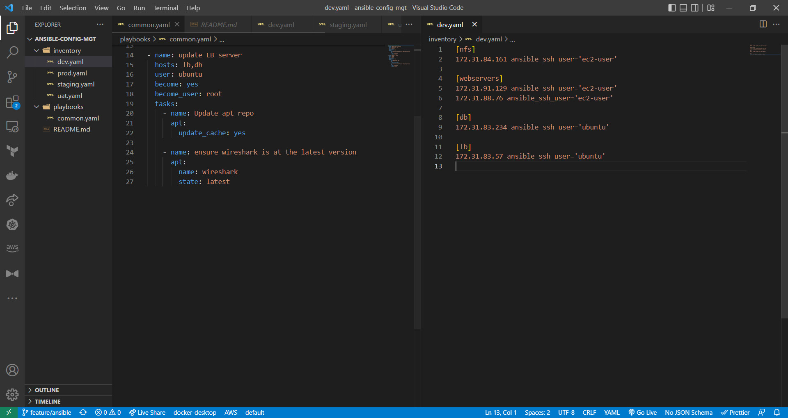

# Ansible_Automation



## Installing Ansible on Jenkins Server
We install ansible on our jenkins server and rename it to `Jenkins-Ansible`

```
sudo apt update

sudo apt install ansible
```


#

Create a new repository called `ansible-config-mgt` on github and set up webhooks on it.

`https://<jenkins_url:port/github-webhooks>`

On the Jenkins server, create a job called `ansible` and configure automatic builds when a trigger is made on the `ansible-config-mgt` directory via GITScm polling.



Test configuration by updating a README file on github.


## Prepare Development using VSCode
#
Download and install vscode which will be used to write and edit code.

## Ansible Configuration
#
Clone `ansible-config-mgt` repo on local machine and create a new branch for development 


- Create a playbooks directory for storing playbooks
- Create an inventory directory for storing inventory files
- In the playbooks folder, create a common.yml file
- In the inventory folder, create dev.yml, prod.yml, staging.yml and uat.yml for dev, prod, staging and uat environments respectively.



